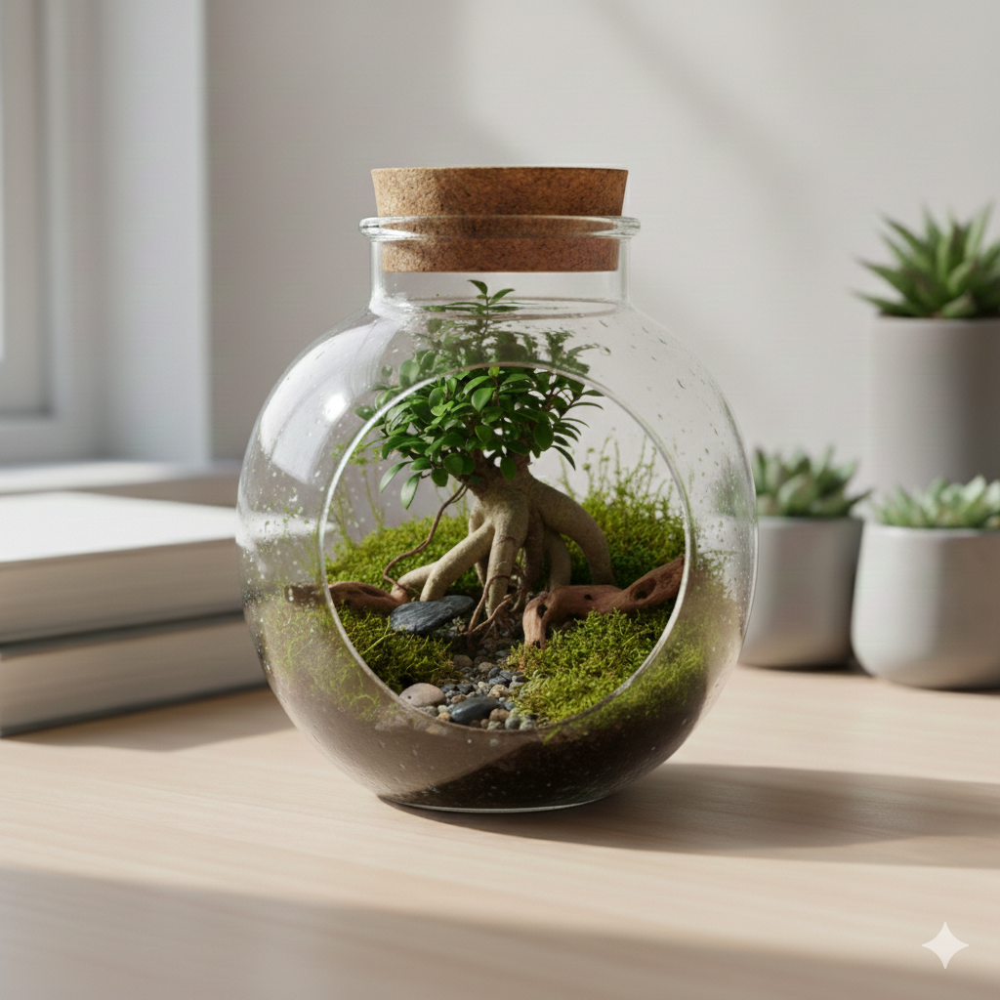

# 🦜 PlantParrot - Terrarios Artesanales

> **Ecosistemas sostenibles en miniatura para llenar tu hogar de vida.**

PlantParrot nace de la pasión por la naturaleza y el diseño artesanal. Creamos terrarios cerrados autosostenibles que funcionan como pequeños bosques en miniatura, ideales para decorar cualquier espacio con un mantenimiento mínimo.

---

## ✨ Características Principales
* **100% Artesanal:** Cada terrario es una pieza única diseñada a mano.
* **Sostenibilidad:** Utilizamos plantas de alta calidad como *Ficus Ginseng* y *Fittonia*.
* **Bajo Mantenimiento:** Gracias al ciclo del agua cerrado, solo requieren riego ocasional.
* **Diseños a Medida:** Creamos proyectos personalizados según el recipiente o espacio del cliente.

---

## 🛍️ Nuestro Catálogo
Puedes ver nuestros productos detallados en la sección de [Productos](https://plantparrot.github.io/plantparrot/productos.html):
1. **Terrario Pequeño:** El toque verde perfecto para tu escritorio.
2. **Terrario Grande:** Un ecosistema frondoso y maduro.
3. **Proyectos a Medida:** Diseños exclusivos bajo pedido.

---

## 🌱 Guía de Cuidados Rápidos
Si ya tienes un PlantParrot, recuerda los tres pilares básicos:
1. **Luz:** Abundante pero **indirecta** (nunca sol directo).
2. **Agua:** Solo cuando la tierra pierda humedad o la condensación desaparezca.
3. **Control:** Ventilar si el cristal presenta gotas de agua muy grandes.

*Consulta la [guía completa aquí](https://plantparrot.github.io/plantparrot/cuidados.html)*

---

## 📧 Contacto y Pedidos
¿Tienes alguna duda o quieres encargar un terrario personalizado?
* **Email:** [plantparrot.info@gmail.com](mailto:plantparrot.info@gmail.com)
* **Web:** [Visita nuestra página oficial](https://plantparrot.github.io/plantparrot/)

---

## 🛠️ Tecnologías utilizadas
Este sitio web ha sido desarrollado utilizando:
* **HTML5** para la estructura.
* **CSS3** para el diseño botánico y responsive.
* **GitHub Pages** para el despliegue y hosting.

---
*© 2026 PlantParrot - Hecho con 🌱 y 🦜*
